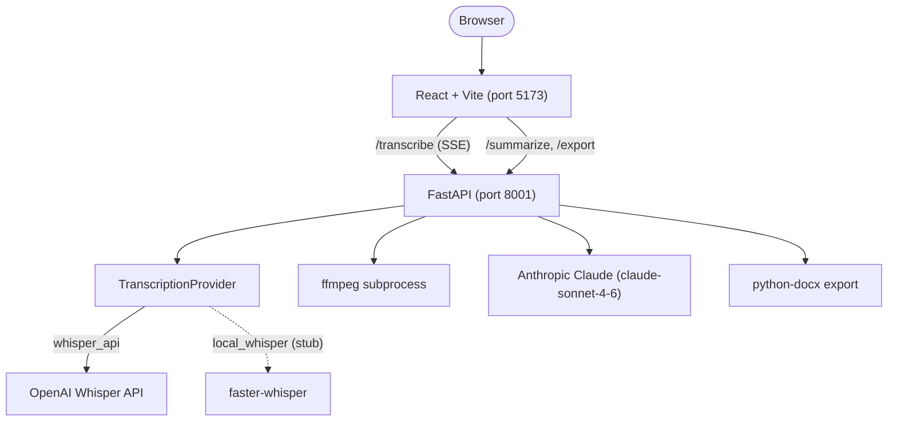

# 🎙️ Meeting Transcription System

[](backend/Dockerfile)
[](backend/main.py)
[](frontend/package.json)
[](frontend/vite.config.ts)
[](frontend/package.json)
[](backend/Dockerfile)
[](backend/tests)

Upload an audio recording of a meeting and receive a full transcript, a structured summary, a participant list, decisions, and action items.

Transcription runs through OpenAI's Whisper API, and Claude turns the raw transcript into structured JSON — participants, decisions, and action items, in whatever language the meeting was held in. The result exports to a `.docx` file, with right-to-left paragraph formatting for Hebrew.

**Live:** [meeting-transcription-system.vercel.app](https://meeting-transcription-system.vercel.app/)

## 📑 Table of Contents

- [🏗️ Architecture](#-architecture)
- [💻 Local Development](#-local-development)
- [🔑 Environment Variables](#-environment-variables)
- [🔌 API](#-api)
- [🧪 Testing](#-testing)
- [📁 Repo Layout](#-repo-layout)
- [👤 Author](#-author)

## 🏗️ Architecture



- **React + Vite frontend** (`frontend/src/App.tsx`) drives the whole flow: upload, an SSE progress
  reader, then the results view. In dev, `vite.config.ts` proxies `/api/*` to `localhost:8001`; in
  production it calls `VITE_API_BASE_URL` directly (see `frontend/src/config.ts`).
- **FastAPI backend** (`backend/main.py`) exposes `/transcribe`, `/summarize`, `/export`, `/health`,
  and `/provider-info`.
- **TranscriptionProvider** (`backend/transcription/base.py`) is an abstract interface. Every
  provider declares its own file-size limits and compression thresholds — `main.py` has no
  provider-specific knowledge. `whisper_api` is implemented; `local_whisper` is a stub backed by
  `faster-whisper`.
- **ffmpeg** compresses files over the active provider's threshold, called directly as a
  subprocess (not through `pydub`). Bitrate is computed per recording from its duration, and
  files too long for one segment are split automatically.
- **Claude** (`backend/summarization.py`) receives the transcript with the system prompt in
  `backend/prompts.md` and returns strict JSON — language, summary, participants, decisions, and
  action items.
- **python-docx export** (`backend/export.py`) builds the downloadable summary, with explicit
  `w:bidi` paragraph formatting for right-to-left languages such as Hebrew.

## 💻 Local Development

**Prerequisites**: Python 3.10+, Node.js 18+, an OpenAI API key, an Anthropic API key, and FFmpeg
on `PATH` (only for files over the active provider's compression threshold — not required if you
run the backend via Docker, which bakes ffmpeg into the image).

1. Clone the repo and configure the backend environment:
   ```bash
   git clone https://github.com/yarins0/meeting-transcription-system
   cd meeting-transcription-system
   cp backend/.env.example backend/.env
   ```
   Fill in `OPENAI_API_KEY` and `ANTHROPIC_API_KEY` in `backend/.env`.
2. Start the backend — either with Docker:
   ```bash
   cd backend
   docker build -t meeting-transcription-backend .
   docker run -p 8001:8001 --env-file .env meeting-transcription-backend
   ```
   or directly:
   ```bash
   cd backend
   pip install -r requirements.txt
   python -m uvicorn main:app --reload --port 8001
   ```
   On Windows, use `python -m uvicorn` rather than a bare `uvicorn` to avoid `PATH` issues.
3. Start the frontend:
   ```bash
   cd frontend
   npm install
   npm run dev
   ```
4. Open [http://localhost:5173](http://localhost:5173). Verify the backend directly with:
   ```bash
   curl http://localhost:8001/health
   ```

**API docs**: FastAPI serves interactive docs at
[http://localhost:8001/docs](http://localhost:8001/docs) (Swagger UI) and
[http://localhost:8001/redoc](http://localhost:8001/redoc) (ReDoc).

## 🔑 Environment Variables

| Variable | Required | Default | Purpose |
|---|---|---|---|
| `OPENAI_API_KEY` | Yes | — | Whisper transcription. |
| `ANTHROPIC_API_KEY` | Yes | — | Claude summarization (`claude-sonnet-4-6`). |
| `TRANSCRIPTION_PROVIDER` | No | `whisper_api` | `whisper_api` or `local_whisper`. |
| `FALLBACK_TRANSCRIPTION_PROVIDER` | No | — | Provider to retry with on failure, e.g. `local_whisper`. |
| `FFMPEG_BIN` | No | — | Full path to the FFmpeg `bin/` directory, if ffmpeg is not on `PATH`. |
| `CORS_ORIGINS` | No | `http://localhost:5173` | Comma-separated allowed origins — set to your domain in production. |

## 🔌 API

| Method | Path | Body | Returns |
|---|---|---|---|
| `POST` | `/transcribe` | multipart file, optional `?provider=` query param | `text/event-stream` — `progress`, `result`, or `error` events |
| `POST` | `/summarize` | `{transcript}` | `SummaryResponse` — language, summary, participants, decisions, action items |
| `POST` | `/export` | `SummaryResponse` fields plus `transcript` | `.docx` file download |
| `GET` | `/health` | — | `{"status": "ok"}` |
| `GET` | `/provider-info` | — | `{provider_name, allowed_extensions, fallback_provider_key}` |

## 🧪 Testing

```bash
cd backend
python -m pytest tests/ -v
```

44 tests across four files: summarization parsing (empty input, markdown-fence stripping,
malformed JSON, wrong schema), docx export sections and RTL, the FastAPI endpoints, and the
compression pipeline (with `ffmpeg` mocked).

## 📁 Repo Layout

```
backend/
  main.py                  # FastAPI app — /health, /provider-info, /transcribe (SSE), /summarize, /export
  summarization.py         # SummaryService + Pydantic models (ActionItem, SummaryResponse)
  export.py                # python-docx export, incl. RTL paragraph formatting
  prompts.md                # Claude system prompt for /summarize — edit here, no Python needed
  transcription/
    base.py                # TranscriptionProvider ABC
    whisper_api.py          # WhisperApiProvider
    local_whisper.py        # LocalWhisperProvider (stub, faster-whisper)
    __init__.py              # get_provider() factory
  tests/                    # pytest suite (44 tests)
  Dockerfile
  requirements.txt
  .env.example

frontend/
  src/
    App.tsx                # orchestrates FileUploadUI → ResultsView flow
    config.ts               # API_BASE — Vite proxy in dev, VITE_API_BASE_URL in production
    hooks/
      useTranscription.ts   # SSE stream reader hook
      useSummarization.ts   # POST /summarize hook
      useExport.ts           # POST /export hook
    components/
      FileUploadUI.tsx      # drag-and-drop + 4-state upload UI
      ResultsView.tsx        # renders all 5 summary sections
      ErrorBoundary.tsx      # React class error boundary
  vite.config.ts            # dev proxy: /api → localhost:8001

PLAN.md                     # implementation plan with phase breakdown
PROCESS.md                  # build log — research, decisions, debugging
```

## 👤 Author

**Yarin Solomon** — Full Stack Developer

- Email: [yarinso39@gmail.com](mailto:yarinso39@gmail.com)
- GitHub: [github.com/yarins0](https://github.com/yarins0)
- LinkedIn: [linkedin.com/in/yarin-solomon](https://www.linkedin.com/in/yarin-solomon/)
- Portfolio: [yarin-lab](https://yarin-lab.vercel.app/)
